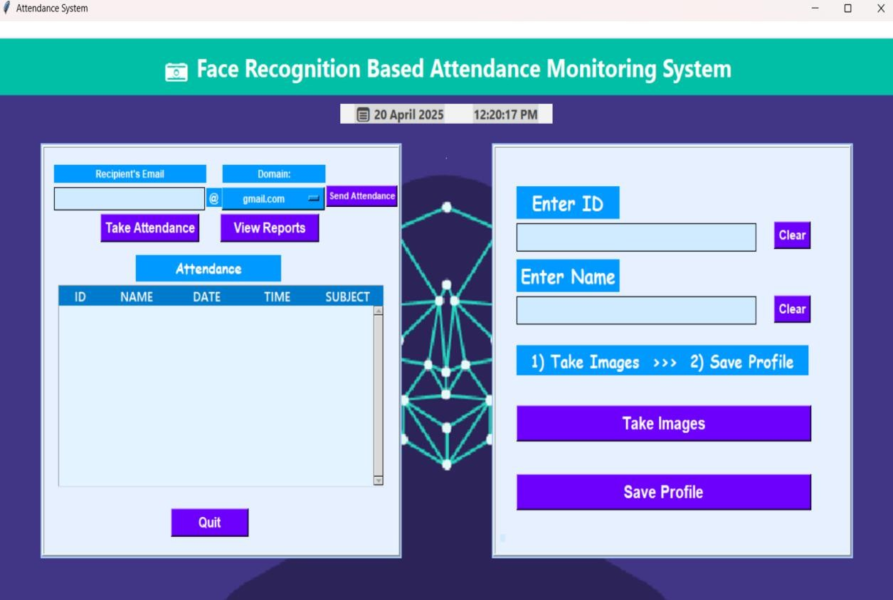
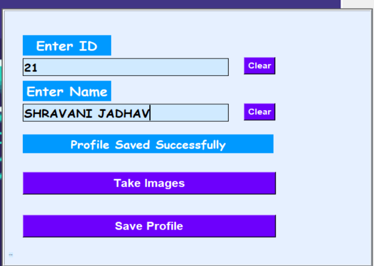
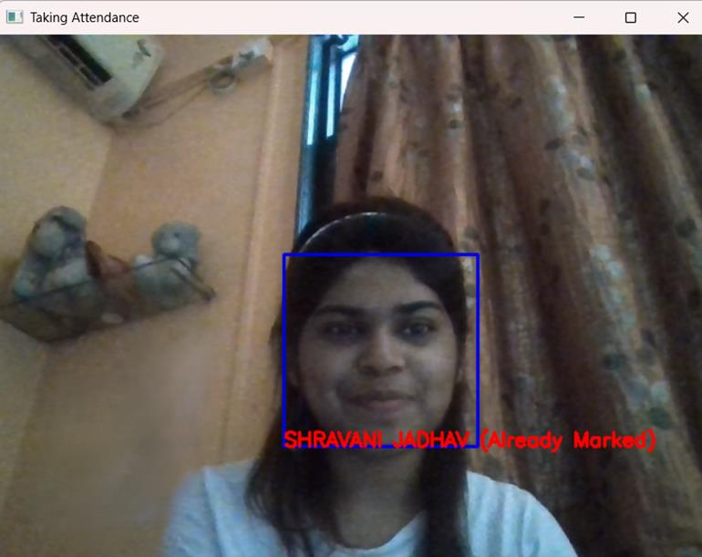
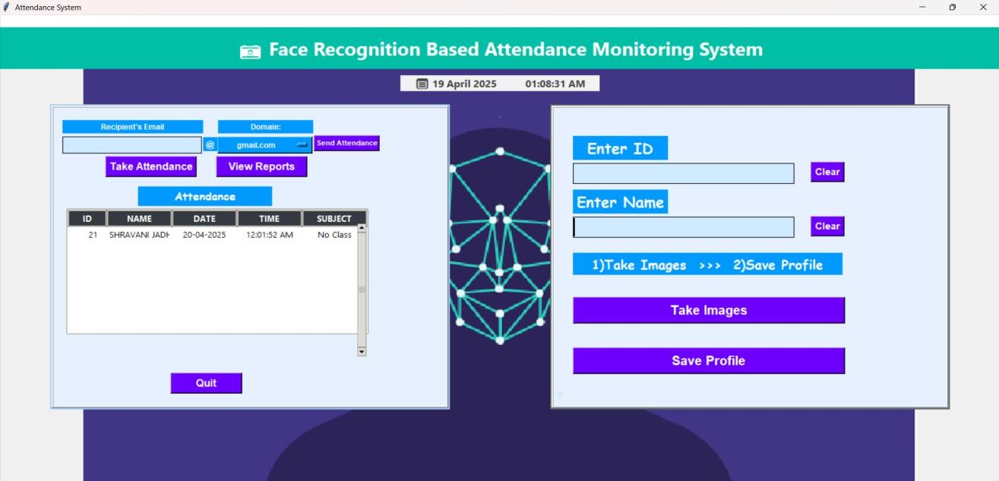
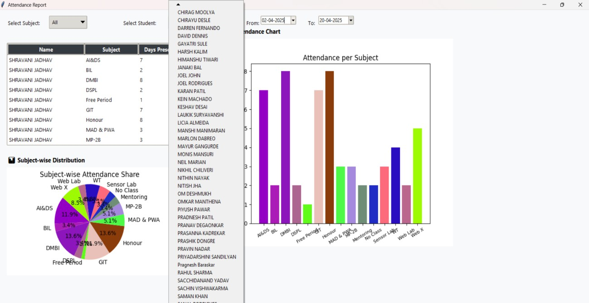
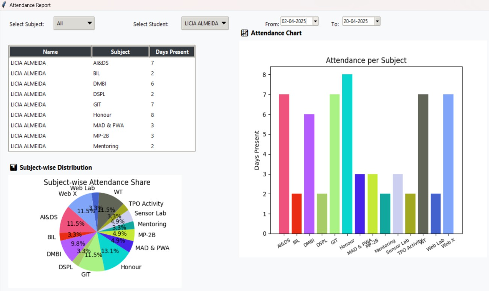
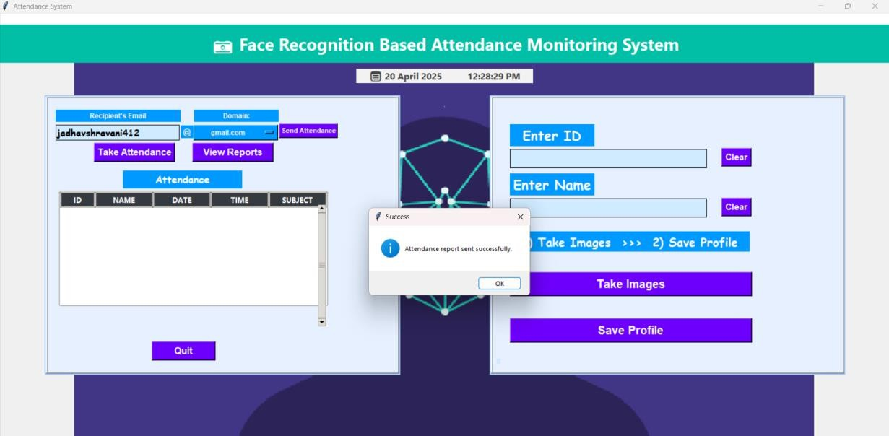
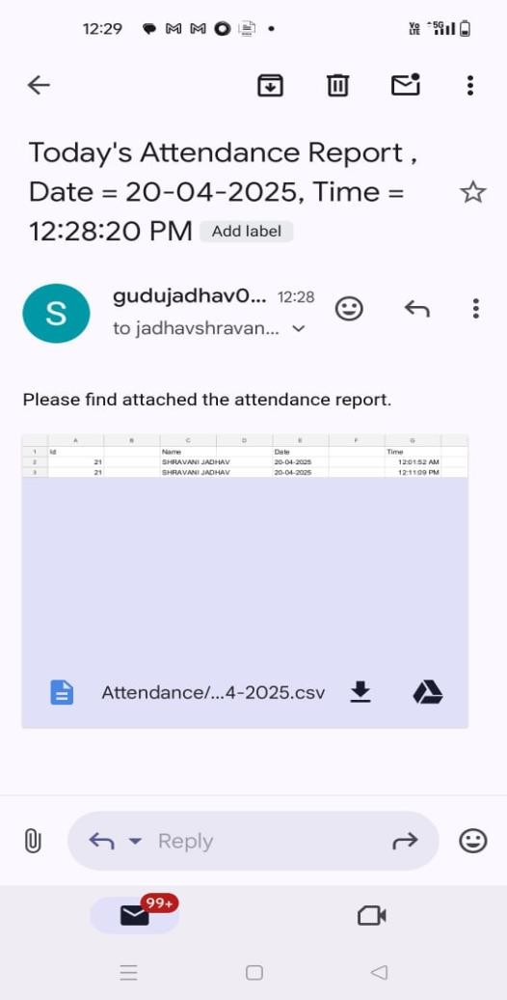
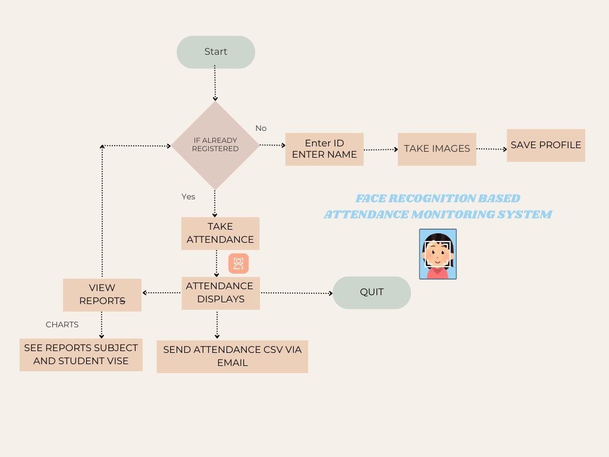

# 👁️ Face Recognition-Based Attendance Monitoring System

A contactless, real-time attendance system that uses facial recognition to detect, identify, and log student attendance automatically — complete with a desktop GUI, subject-wise reporting, and one-click email delivery of attendance sheets.


---

## 📖 Overview

Traditional attendance methods — roll calls, sign-in sheets, RFID cards, biometric scanners — are slow, error-prone, and often require physical contact. This project replaces them with a fully automated, offline, face-recognition-driven system built for classroom use.

The system captures a student's facial data once during registration, then recognizes them live via webcam during every class, cross-checks the detection against the batch timetable, and logs attendance to subject-wise CSV files — which can be emailed out directly from the app.

Built and tested on a real Third-Year Engineering (IT) batch timetable and student roster at Xavier Institute of Engineering, Mumbai.

## ✨ Features

- **Contactless registration** — capture and store a student's facial dataset with ID and name
- **Real-time recognition** — detects and identifies faces live from a webcam feed
- **Timetable-aware logging** — attendance is only marked when a class is actually scheduled, preventing misuse
- **Subject-wise CSV reports** — auto-generated, filterable by student or subject
- **Visual analytics** — pie charts and histograms for attendance trends
- **One-click email delivery** — send attendance CSVs straight from the dashboard via SMTP
- **Fully offline** — no server or internet dependency required to run

## 🎬 Demo / Screenshots

| Main Dashboard | Save Profile |
|---|---|
|  |  |

| Live Face Recognition | Attendance Display |
|---|---|
|  |  |

| Student / Subject Report Selection | Student Detail Report |
|---|---|
|  |  |

| Emailing the Report | Email Received |
|---|---|
|  |  |

## 🧩 Methodology

### System Architecture / Conceptual Flow

The application checks whether a user is already registered. New users go through **ID entry → image capture → profile save**. Returning users go straight to **attendance marking**, after which they can view subject/student-wise reports as charts or email the CSV report directly.



### Algorithms Used

**1. Face Detection — Haar Cascade Classifier**

Used to detect faces in the live webcam feed the moment a user clicks *"Take Images"* or *"Take Attendance"*.

- Uses pre-trained Haar-like feature classifiers (OpenCV's `haarcascade_frontalface_default.xml`) that compare intensity differences across rectangular image regions
- Applies a cascade of classifiers — early stages quickly discard non-face regions, later stages refine detection
- Scans the frame at multiple scales/positions and draws a bounding box around detected faces
- **Why:** fast, lightweight, and effective for real-time frontal-face detection without needing a GPU

**2. Face Recognition — Local Binary Pattern Histogram (LBPH)**

Used to match a detected face against the trained dataset during attendance marking.

1. Convert the detected face region to grayscale
2. Apply the Local Binary Pattern operator — each pixel is compared to its neighbors to produce a binary code
3. Divide the face into regions and compute an LBP histogram per region
4. Concatenate all regional histograms into a single feature vector
5. Compare the test vector against stored vectors using a distance metric (Euclidean / Chi-square) to find the closest match

- **Why LBPH:** robust to lighting variation, fast, simple to train/retrain, and doesn't need a GPU — ideal for a lab/classroom deployment
- **Trade-off:** less accurate than deep-learning approaches (CNN/FaceNet) on large, diverse datasets — a noted direction for future work

**3. Supporting workflows**

- **Email delivery:** Python's `smtplib` sends the generated CSV attendance report as an email attachment directly from the dashboard
- **Attendance simulation:** a standalone script (`generate_attendance.py.py` — note the doubled extension in the repo) can batch-generate or simulate attendance records from the timetable and student roster, useful for testing and demos

## 🛠️ Tech Stack

| Layer | Technology |
|---|---|
| Language | Python 3.x |
| Face Detection | OpenCV — Haar Cascade Classifier (`haarcascade_frontalface_default.xml`) |
| Face Recognition | OpenCV — `cv2.face.LBPHFaceRecognizer` |
| GUI | Tkinter, `tkcalendar` |
| Data Handling | Pandas, NumPy |
| Visualization | Matplotlib |
| Reporting | CSV file storage |
| Email | `smtplib` (SMTP) |

## 📁 Project Structure

Based on the [repository layout](https://github.com/SHRAVANIMJ24/Face-Recognition-Attendance-System):

```
Face-Recognition-Attendance-System/
├── main.py                          # Entry point — builds the GUI and wires up all buttons
├── config.py
├── facial_recognition/
│   ├── capture.py                   # TakeImages() — webcam face capture for registration
│   ├── train.py                     # TrainImages() — trains the LBPH recognizer
│   └── attendance.py                # TrackImages() — live recognition + attendance logging
├── gui/
│   ├── main_window.py               # initialize_main_window() — main window, clock, background
│   ├── frames.py                    # create_main_frames()
│   ├── widgets.py                   # create_labels_entries_buttons(), create_treeview()
│   └── report_window.py             # open_report_window() — filterable report + charts
├── utils/
│   ├── email_utils.py               # send_email() — emails the day's attendance CSV
│   ├── file_utils.py                # delete_registration_csv/delete_attendance_csv/delete_registered_images
│   └── password_utils.py            # change_pass() — admin password handling
├── generate_attendance.py.py        # Standalone script to simulate/batch-generate attendance for demos
├── haarcascade_frontalface_default.xml   # Pre-trained OpenCV face-detection model
├── TimeTable.csv                    # Weekly timetable used to resolve the current subject
├── StudentDetails/                  # Registered students (serial, ID, name)
├── TrainingImageLabel/
│   ├── Trainner.yml                 # Saved/trained LBPH model
│   └── psd.txt                      # Stored admin password
├── Attendance/                      # One CSV per day, e.g. Attendance_20-04-2025.csv
├── attendance_sheet_corrected.csv   # Sample/demo attendance data
├── background_image1.png, img2.png, img2a.png, img3.JPG   # GUI background/branding assets
└── install commands .txt            # Maintainer's own pip install reference
```

> This tree reflects the actual folders/files in the linked repo. `main.py` imports `TakeImages`/`TrainImages` from `facial_recognition/`, `TrackImages` for attendance, and `send_email`/`change_pass`/file-deletion helpers from `utils/` — confirmed directly from `main.py`'s imports.

## 💻 Requirements

**Hardware**

| Component | Specification |
|---|---|
| Processor | Intel i3 or higher |
| RAM | 4 GB minimum |
| Camera | Inbuilt/USB webcam |
| Storage | 10 GB free disk space minimum |

**Software**

| Component | Version / Tool |
|---|---|
| OS | Windows 10+ / Linux |
| Python | 3.x |
| Libraries | `opencv-python`, `numpy`, `pandas`, `tkinter`, `tkcalendar`, `matplotlib`, `smtplib`, `dlib` *(optional)* |
| IDE | VS Code / PyCharm / Jupyter Notebook |

## ⚙️ Installation

```bash
# Clone the repository
git clone https://github.com/SHRAVANIMJ24/Face-Recognition-Attendance-System.git
cd Face-Recognition-Attendance-System

# (Recommended) create a virtual environment
python -m venv venv
source venv/bin/activate      # Windows: venv\Scripts\activate

# Install dependencies
pip install opencv-contrib-python numpy pandas matplotlib tkcalendar
```

> Use `opencv-contrib-python`, not plain `opencv-python` — the `cv2.face` module that provides the LBPH recognizer only ships in the contrib build. There's also an `install commands .txt` in the repo with the maintainer's own reference list; cross-check it against a fresh virtual environment before trusting every entry in it.

## ▶️ Usage

1. Launch the application:
   ```bash
   python main.py
   ```
2. **Register a new student:** enter an ID and name → click *Take Images* → capture face samples → click *Save Profile* (this trains the LBPH model on the captured images).
3. **Mark attendance:** click *Take Attendance* → the system detects and recognizes faces live and logs them against the scheduled subject.
4. **View reports:** click *View Reports* → filter by student or subject → view as charts (pie chart / histogram).
5. **Email a report:** enter a recipient's email and pick a domain from the dropdown → click *Send Attendance*.

## 📊 Performance

| Metric | Observation |
|---|---|
| Face Detection Time | ~8 seconds per frame |
| Recognition Accuracy | ~90–95% for registered students |
| Training Time | ~2–3 seconds for 101 images/person |
| Recognition Time | Near-instantaneous (< 0.5s) |
| Email Delivery | Successfully sent CSV reports |
| Usability | Smooth GUI experience for end users |

- High accuracy under **consistent lighting** conditions
- False rejections were minimal, mostly caused by **extreme angles or occluded faces**

## ⚠️ Known Limitations

- Performance drops under poor lighting or facial occlusion (masks, turned faces)
- Currently tuned for small datasets — scaling to large student populations needs further work
- No liveness detection (spoofing via photos is not currently prevented)

## 🔒 Before You Make This Public

Two things worth checking, since the repo stores real data from testing:

- **Email credentials:** the existing README in your repo flags that `utils/email_utils.py` may have Gmail credentials set directly in the code. If that file has ever been pushed, treat the app password as compromised and regenerate it in your Google Account's App Password settings — then load credentials from environment variables instead (`os.environ["ATTENDANCE_EMAIL"]`, etc.) and keep them out of version control via `.gitignore`.
- **Admin password:** `TrainingImageLabel/psd.txt` stores the admin password as plain text. Anyone with repo access (or a copy of it) can read it directly. Consider hashing it (e.g. with `hashlib` or `bcrypt`) before storing, and gitignoring the file so a real password never ends up in version control.
- **Student data:** `StudentDetails/` and `Attendance/` contain real names/IDs from testing. Consider a `.gitignore` for runtime-generated folders so this doesn't ship with the source:
  ```
  TrainingImage/
  TrainingImageLabel/*.yml
  TrainingImageLabel/psd.txt
  Attendance/
  StudentDetails/
  venv/
  __pycache__/
  ```

## 🚀 Future Enhancements

- [ ] Add mask detection for post-COVID scenarios
- [ ] Move from CSV storage to a central database
- [ ] Add mobile support or a web-based dashboard
- [ ] Upgrade recognition to deep-learning models (CNN, FaceNet) for larger datasets
- [ ] Implement admin authentication for secure data access

## 📚 References

- [Face Recognition based Attendance Management System](https://www.researchgate.net/publication/341876647_Face_Recognition_based_Attendance_Management_System) — ResearchGate
- [Face Recognition based Attendance System](https://www.ijert.org/research/face-recognition-based-attendance-system-IJERTV9IS060615.pdf) — IJERT
- [Face Recognition-based Lecture Attendance System](https://ieeexplore.ieee.org/abstract/document/5989909) — IEEE
- [Facial Recognition Attendance System using ML & DL](https://www.ijert.org/facial-recognition-attendance-system-using-machine-learning-and-deep-learning) — IJERT
- [Face Recognition: A Literature Review](https://www.researchgate.net/publication/233864740_Face_Recognition_A_Literature_Review) — ResearchGate
- [An Embedded Intelligent System for Attendance Monitoring](https://arxiv.org/abs/2406.13694) — arXiv, 2024
- [OpenCV Documentation](https://docs.opencv.org/)
- [OpenCV — LBPH Face Recognizer](https://docs.opencv.org/3.4/dc/dc3/tutorial_py_face_detection.html)
- [OpenCV — Haar Cascade Classifier](https://docs.opencv.org/3.4/db/d28/tutorial_cascade_classifier.html)
- [Python Documentation](https://www.python.org/doc/)

## 👥 Contributors

- Licia Almeida
- Janaki Bal
- Shravani Jadhav
- P.S. Priyadarshini

Developed as a mini-project at the **Department of Information Technology, Xavier Institute of Engineering, University of Mumbai**, under the guidance of **Dr. Chhaya Dhavale**.

## 📄 License

*Add a license (e.g. MIT) here if you intend to open-source this project.*
